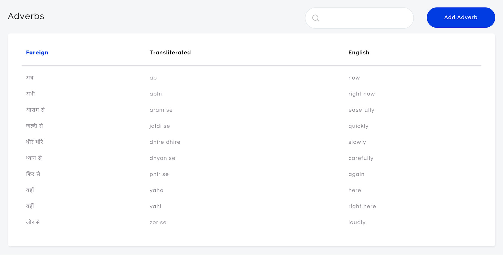
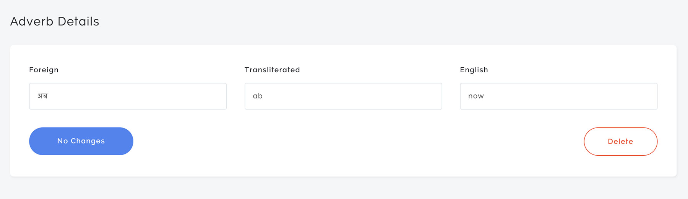

# Handy Components

Are you tired of copying/pasting React code across your multiple side projects? I certainly was. I decided to make an npm package so I could maintain my React components in one place but still use them across my different apps.

## Installation

`npm install --save handy-components`

## Usage

### Standard Index

The `StandardIndex` component is sortable by column and has a frontend search.



```javascript
import { StandardIndex } from 'handy-components';

ReactDOM.render(
  <Provider context={ MyContext } store={ store }>
    <StandardIndex
      context={ MyContext }
      entityName='adverb'
      columns={ ['foreign', 'transliterated', 'english'] }
    />
  </Provider>,
  document.querySelector('#adverbs-index')
);
```

### Simple Details

The `SimpleDetails` component is ideal for showing and editing database records without a lot of complexity. The component indicates when there are unsaved changes. It also includes a delete confirmation modal.



```javascript
import { SimpleDetails } from 'handy-components';

ReactDOM.render(
  <Provider context={ MyContext } store={ store }>
    <SimpleDetails
      context={ MyContext }
      entityName='adverb'
      initialEntity={ {} }
      fields={ [[
        { columnWidth: 4, entity: 'adverb', property: 'foreign' },
        { columnWidth: 4, entity: 'adverb', property: 'transliterated' },
        { columnWidth: 4, entity: 'adverb', property: 'english' }
      ]] }
    />
  </Provider>,
  document.querySelector('#adverb-details')
);
```
